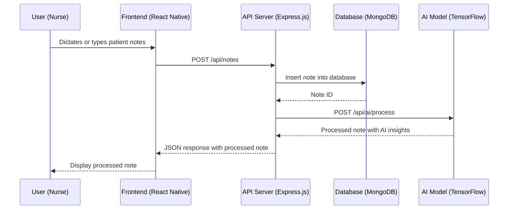
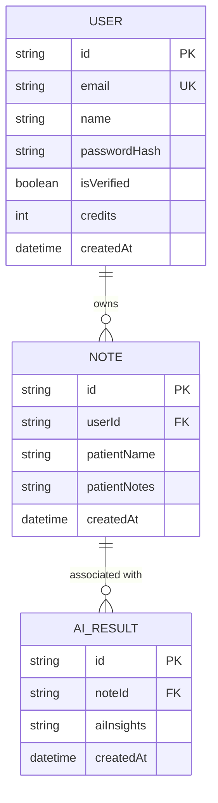

# NurseNote AI
### MVP Architecture Document
> **Team:** Talha Zahoor · **Duration:** 32 weeks · **Stack:** React Native, Node.js, TensorFlow

---

## 1. Executive Summary
NurseNote AI is an AI-powered note-taking platform designed specifically for nurses, aiming to automate note-taking, reduce errors, and improve patient care. The platform will utilize natural language processing and machine learning to provide a tailored solution for nursing workflows. By leveraging AI, NurseNote AI will help nurses save time and focus on more critical aspects of patient care, ultimately leading to better outcomes.

The end-user experience will involve nurses interacting with the mobile application, dictating or typing notes, which will then be processed by the AI engine to generate accurate and comprehensive patient records. The platform will also provide customizable nursing workflows, allowing hospitals and healthcare organizations to tailor the system to their specific needs.

NurseNote AI will deliver significant value to the healthcare industry by reducing the administrative burden on nurses, improving the accuracy of patient records, and enhancing patient care. The platform will also provide insights and analytics to healthcare organizations, enabling them to optimize their workflows and improve patient outcomes.

## 2. System Architecture Overview

### 2.1 High-Level Architecture Diagram
```
┌─────────────────────────────────┐
│         React Native         │
└────────────┬────────────────────┘
             │ HTTPS / REST
┌────────────▼────────────────────┐
│      Express.js API Server      │
│  ┌──────────┐  ┌─────────────┐  │
│  │  Routes  │  │  Middleware │  │
│  └──────────┘  └─────────────┘  │
│  ┌──────────────────────────┐   │
│  │     Service Layer        │   │
│  └──────────────────────────┘   │
└───┬──────────────┬──────────────┘
    │              │
┌───▼───┐    ┌─────▼──────┐
│MongoDB│    │ TensorFlow  │
│ Atlas │    │  AI Model    │
└───────┘    └────────────┘
```

### 2.2 Request Flow Diagram (Mermaid)


### 2.3 Architecture Pattern
The architecture pattern chosen for NurseNote AI is a layered architecture, consisting of a frontend, API server, service layer, and database. This pattern suits the team size and timeline as it allows for a clear separation of concerns, scalability, and maintainability.

### 2.4 Component Responsibilities
The frontend is responsible for user interaction, displaying patient notes, and handling user input. The API server handles requests from the frontend, communicates with the service layer, and returns responses to the frontend. The service layer encapsulates the business logic, interacts with the database, and communicates with the AI model. The database stores patient notes, user information, and other relevant data. The AI model processes patient notes, provides insights, and returns the results to the service layer.

## 3. Tech Stack & Justification

| Layer | Technology | Why chosen |
|-------|-----------|------------|
| Frontend | React Native | Cross-platform compatibility, fast development, and large community support |
| API Server | Express.js | Lightweight, flexible, and scalable framework for building RESTful APIs |
| Service Layer | Node.js | JavaScript runtime environment for executing server-side logic |
| Database | MongoDB | NoSQL database for storing and retrieving patient notes and user information |
| AI Model | TensorFlow | Open-source machine learning framework for building and training AI models |

## 4. Database Design

### 4.1 Entity-Relationship Diagram


### 4.2 Relationship & Association Details
The relationship between User and Note is one-to-many, where a user can have multiple notes. The relationship between Note and AI_Result is one-to-one, where a note is associated with a single AI result.

### 4.3 Schema Definitions (Code)
```typescript
const userSchema = new Schema({
  email: { type: String, required: true, unique: true, lowercase: true },
  name: { type: String, required: true },
  passwordHash: { type: String, required: true },
  isVerified: { type: Boolean, default: false },
  credits: { type: Number, default: 0 },
  createdAt: { type: Date, default: Date.now },
});

const noteSchema = new Schema({
  userId: { type: String, required: true, ref: 'User' },
  patientName: { type: String, required: true },
  patientNotes: { type: String, required: true },
  createdAt: { type: Date, default: Date.now },
});

const aiResultSchema = new Schema({
  noteId: { type: String, required: true, ref: 'Note' },
  aiInsights: { type: String, required: true },
  createdAt: { type: Date, default: Date.now },
});
```

### 4.4 Indexing Strategy
The indexing strategy will include single indexes on User.email, Note.userId, and AI_Result.noteId. Compound indexes will be used on Note.patientName and Note.patientNotes.

### 4.5 Data Flow Between Entities
When a user dictates or types patient notes, a new Note document is created in the database. The Note document is then processed by the AI model, and the resulting AI insights are stored in a new AI_Result document. The AI_Result document is associated with the original Note document through a foreign key reference.

## 5. API Design

### 5.1 Authentication & Authorization
The API will use JSON Web Tokens (JWT) for authentication. Protected routes will be guarded by a middleware function that verifies the JWT token.

### 5.2 REST Endpoints
| Method | Path | Auth | Request Body | Response | Description |
|--------|------|------|--------------|----------|-------------|
| POST | /api/notes | Required | { patientName: string, patientNotes: string } | { noteId: string } | Create a new note |
| GET | /api/notes | Required | - | [ { noteId: string, patientName: string, patientNotes: string } ] | Retrieve a list of notes |
| POST | /api/ai/process | Required | { noteId: string } | { aiInsights: string } | Process a note with AI |

### 5.3 Error Handling
The API will use a standard error response format, including an error code, message, and details.

## 6. Frontend Architecture

### 6.1 Folder Structure
The frontend folder structure will include:
* components: reusable UI components
* containers: components that wrap other components
* screens: top-level screens that render containers
* utils: utility functions for handling data and API calls
* App.js: the main application entry point

### 6.2 State Management
The frontend will use a combination of local state and global state management using Redux. Global state will include user information, notes, and AI results.

### 6.3 Key Pages & Components
The main pages and components will include:
* NoteScreen: a screen that displays a list of notes
* NoteEditor: a component that allows users to edit notes
* AiResultsScreen: a screen that displays AI results

## 7. Core Feature Implementation

### 7.1 AI-Powered Note-Taking
* User flow: The user dictates or types patient notes, which are then processed by the AI model.
* Frontend: The NoteEditor component handles user input and sends the note to the API server.
* API call: The API server receives the note and sends it to the AI model for processing.
* Backend logic: The AI model processes the note and returns the resulting AI insights.
* Database: The AI insights are stored in a new AI_Result document associated with the original Note document.
* AI integration: The AI model is integrated using the TensorFlow API.
* Code snippet:
```typescript
const processNote = async (noteId: string) => {
  const note = await Note.findById(noteId);
  const aiInsights = await tensorflow.processNote(note.patientNotes);
  const aiResult = new AI_Result({ noteId, aiInsights });
  await aiResult.save();
  return aiResult;
};
```

### 7.2 Customizable Nursing Workflows
* User flow: The user configures the nursing workflow by selecting options and saving the configuration.
* Frontend: The WorkflowEditor component handles user input and sends the configuration to the API server.
* API call: The API server receives the configuration and updates the user's workflow settings.
* Backend logic: The workflow settings are stored in the user's document.
* Database: The workflow settings are stored in the User document.
* AI integration: Not applicable.
* Code snippet:
```typescript
const updateWorkflow = async (userId: string, workflowSettings: any) => {
  const user = await User.findById(userId);
  user.workflowSettings = workflowSettings;
  await user.save();
  return user;
};
```

## 7a. AI Pipeline Architecture
The AI pipeline will use the following components:
* TensorFlow: an open-source machine learning framework for building and training AI models
* AI Model: a trained model that processes patient notes and returns AI insights
* AI Service: a service that exposes the AI model as a RESTful API
The AI pipeline will work as follows:
1. The user dictates or types patient notes, which are then sent to the AI service.
2. The AI service receives the note and preprocesses it by tokenizing the text and removing stop words.
3. The preprocessed note is then passed to the AI model, which processes the note and returns the resulting AI insights.
4. The AI insights are then postprocessed by the AI service, which formats the insights into a human-readable format.
5. The final AI insights are then returned to the user.
The AI model will be trained using a dataset of patient notes and corresponding AI insights. The model will be fine-tuned using a combination of supervised and unsupervised learning techniques.
The AI service will be exposed as a RESTful API, which will receive requests from the frontend and return responses containing the AI insights.

## 8. Security Considerations
The following security considerations will be addressed:
* Input validation: The API will validate all user input to prevent SQL injection and cross-site scripting (XSS) attacks.
* Authentication token storage: The API will store authentication tokens securely using a secure token store.
* CORS policy: The API will implement a CORS policy to restrict access to authorized domains.
* Rate limiting: The API will implement rate limiting to prevent abuse and denial-of-service (DoS) attacks.
* File upload safety: The API will validate all file uploads to prevent malicious file uploads.
* Environment secrets management: The API will use a secrets management system to securely store and retrieve environment secrets.

## 9. MVP Scope Definition

### 9.1 In Scope (MVP)
The following features will be included in the MVP:
* AI-powered note-taking
* Customizable nursing workflows
* Error reduction and patient care improvement

### 9.2 Out of Scope (Post-MVP)
The following features will be deferred to post-MVP:
* Integration with electronic health records (EHRs)
* Support for multiple languages
* Advanced analytics and reporting

### 9.3 Success Criteria
The MVP will be considered successful if the following criteria are met:
* The AI model achieves an accuracy of 90% or higher on a test dataset.
* The user interface is intuitive and easy to use.
* The system reduces errors and improves patient care.

## 10. Week-by-Week Implementation Plan

Week 1-2: Frontend setup and user authentication
* Focus: Set up the frontend framework and implement user authentication
* Deliverable: A working frontend with user authentication
* Done-when: The user can log in and see the main screen

Week 3-4: API setup and note creation
* Focus: Set up the API framework and implement note creation
* Deliverable: A working API with note creation endpoint
* Done-when: The user can create a new note and see it in the list

Week 5-6: AI model integration
* Focus: Integrate the AI model with the API
* Deliverable: A working AI model that processes notes and returns AI insights
* Done-when: The user can see AI insights for a note

Week 7-8: Customizable nursing workflows
* Focus: Implement customizable nursing workflows
* Deliverable: A working workflow editor that allows users to configure workflows
* Done-when: The user can configure a workflow and see it in action

Week 9-10: Error reduction and patient care improvement
* Focus: Implement error reduction and patient care improvement features
* Deliverable: A working system that reduces errors and improves patient care
* Done-when: The system reduces errors and improves patient care

Week 11-12: Testing and deployment
* Focus: Test the system and deploy it to production
* Deliverable: A working system in production
* Done-when: The system is live and functional

## 11. Testing Strategy

| Type | Tool | What is tested | Target coverage |
|------|------|---------------|-----------------|
| Unit | Jest | Frontend and API components | 80% |
| Integration | Cypress | Frontend and API interactions | 80% |
| End-to-end | Cypress | Entire system | 80% |

## 12. Deployment & DevOps

### 12.1 Local Development Setup
To set up the project locally, run the following commands:
* `git clone https://github.com/talhazahoor/nursenote-ai.git`
* `cd nursenote-ai`
* `npm install`
* `npm start`

### 12.2 Environment Variables
The following environment variables are required:
* `REACT_APP_API_URL`: the URL of the API server
* `REACT_APP_AI_MODEL_URL`: the URL of the AI model server

### 12.3 Production Deployment
The system will be deployed to a cloud platform (e.g. AWS or Google Cloud) using a CI/CD pipeline.

## 13. Risk Register

| Risk | Likelihood | Impact | Mitigation |
|------|-----------|--------|-----------|
| Delay in AI model development | High | High | Hire additional AI engineer |
| Insufficient testing | Medium | Medium | Increase testing coverage |
| Security vulnerabilities | High | High | Implement security best practices |
| User adoption | Medium | Medium | Conduct user testing and gather feedback |
| Technical debt | High | High | Prioritize technical debt and address it regularly |